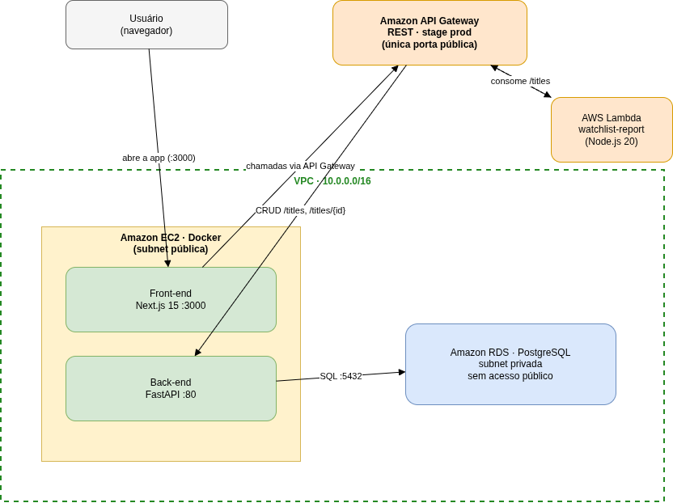

# Projeto Integrador – Cloud Developing 2026/1

> Watchlist de filmes/séries · CRUD + API Gateway + Lambda `/report` + RDS + Front-end

**Grupo:**
1. 10441930 - Gabriela Nellessen de Sousa - Desenvolvimento full-stack, infraestrutura AWS, documentação e vídeo

## 1. Visão geral

Aplicação web de **watchlist pessoal de filmes e séries**: permite cadastrar, listar, atualizar e remover títulos (entidade única `title`) e gera um dashboard de estatísticas (`/report`) calculado por uma função Lambda.

O domínio foi escolhido por ser fácil de povoar com dados realistas e gerar estatísticas variadas: total por gênero, percentual assistido, duração média e nota média.

## 2. Arquitetura



| Camada | Serviço AWS | Tecnologia |
|---|---|---|
| Back-end | EC2 + Docker (subnet pública) | FastAPI + SQLModel (Python 3.12) |
| Front-end | EC2 + Docker (subnet pública) | Next.js 15 (App Router) + Tailwind |
| Banco | Amazon RDS (subnet privada) | PostgreSQL 15 |
| Gateway | Amazon API Gateway (REST) | HTTP Proxy + Lambda Proxy |
| Função `/report` | AWS Lambda | Node.js 20 (ES Modules) |

**Restrições do enunciado atendidas:**
- RDS em subnet privada, sem acesso público ✅
- API Gateway é a única porta de entrada externa para os dados ✅
- Lambda consome a API via HTTP (API Gateway), sem acessar o RDS diretamente ✅
- Front-end consome o back-end e a Lambda sempre via API Gateway ✅

## 3. Como rodar localmente

Pré-requisitos: Docker, Docker Compose, Node.js 20+ e npm.

**Back-end + Postgres:**
```bash
docker compose up --build
# API em http://localhost:8000
curl http://localhost:8000/titles/   # 12 títulos do seed
```

**Front-end (em outro terminal):**
```bash
cd src/frontend
cp .env.local.example .env.local
npm install
npm run dev
# Front em http://localhost:3000
```

**Lambda (opcional, com o back-end no ar):**
```bash
cd src/lambda
API_GATEWAY_URL=http://localhost:8000 node -e "import('./index.mjs').then(m => m.handler({}).then(r => console.log(r.body)))"
```

## 4. Endpoints da API

| Método | Rota | Descrição |
|---|---|---|
| GET    | `/`             | Healthcheck |
| GET    | `/titles/`      | Lista (paginação `?offset&limit`) |
| GET    | `/titles/{id}`  | Busca por ID |
| POST   | `/titles/`      | Cria |
| PUT    | `/titles/{id}`  | Atualiza |
| DELETE | `/titles/{id}`  | Remove |
| GET    | `/report`       | (Lambda) estatísticas em JSON |

## 5. Modelo de dados

```sql
CREATE TABLE title (
    id               SERIAL PRIMARY KEY,
    name             VARCHAR NOT NULL,
    kind             VARCHAR NOT NULL,    -- 'movie' | 'series'
    genre            VARCHAR,
    year             INTEGER,
    duration_minutes INTEGER,
    rating           NUMERIC,
    watched          BOOLEAN NOT NULL DEFAULT false,
    notes            TEXT
);
```

Seed inicial em `src/backend/initialize.sql` (12 títulos).

## 6. Deploy na AWS

Passo a passo completo em [`docs/AWS-steps.md`](docs/AWS-steps.md). Resumo:

1. VPC + subnets pública/privada + IGW + Security Groups
2. RDS PostgreSQL em subnet privada (sem acesso público)
3. EC2 (Amazon Linux 2023) com Docker, rodando os containers do back-end e do front-end
4. Lambda `watchlist-report` (Node.js 20)
5. API Gateway: `/titles` e `/titles/{id}` → back-end; `/report` → Lambda; stage `prod`

## 7. Variáveis de ambiente

### Back-end
| Variável | Exemplo |
|---|---|
| `DB_HOST` | `watchlist-db.xxxx.us-east-1.rds.amazonaws.com` |
| `DB_PORT` | `5432` |
| `DB_USER` | `postgres` |
| `DB_PASSWORD` | (senha do RDS) |
| `DB_NAME` | `watchlist` |

### Front-end
| Variável | Exemplo |
|---|---|
| `NEXT_PUBLIC_API_BASE_URL` | `https://xxxx.execute-api.us-east-1.amazonaws.com/prod` |

### Lambda
| Variável | Exemplo |
|---|---|
| `API_GATEWAY_URL` | `https://xxxx.execute-api.us-east-1.amazonaws.com/prod` |

## 8. Estrutura do projeto

```
gabi-watchlist/
├── README.md
├── docker-compose.yml          # dev local (api + postgres)
├── docker-compose.prod.yml     # produção na EC2 (api + front)
├── docs/
│   ├── arquitetura.png
│   ├── AWS-steps.md
│   └── screenshots/
├── infra/
│   ├── rds-config.md
│   └── vpc-config.md
└── src/
    ├── backend/    # FastAPI + Dockerfile + initialize.sql
    ├── frontend/   # Next.js 15 + Tailwind + Dockerfile
    └── lambda/     # index.mjs (Node 20 ES Modules)
```

## 9. Vídeo de demonstração

🎥 https://www.youtube.com/watch?v=Tmhgoa0qYRg

## 10. Tecnologias

- **Back-end**: FastAPI · SQLModel · PostgreSQL · Python 3.12
- **Front-end**: Next.js 15 · React · TypeScript · Tailwind CSS
- **Lambda**: Node.js 20 · ES Modules
- **Infra**: Docker · AWS EC2 · RDS · API Gateway · Lambda · VPC
